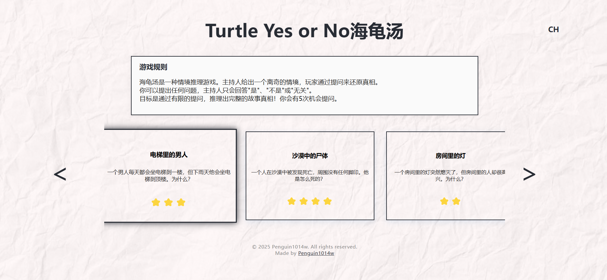
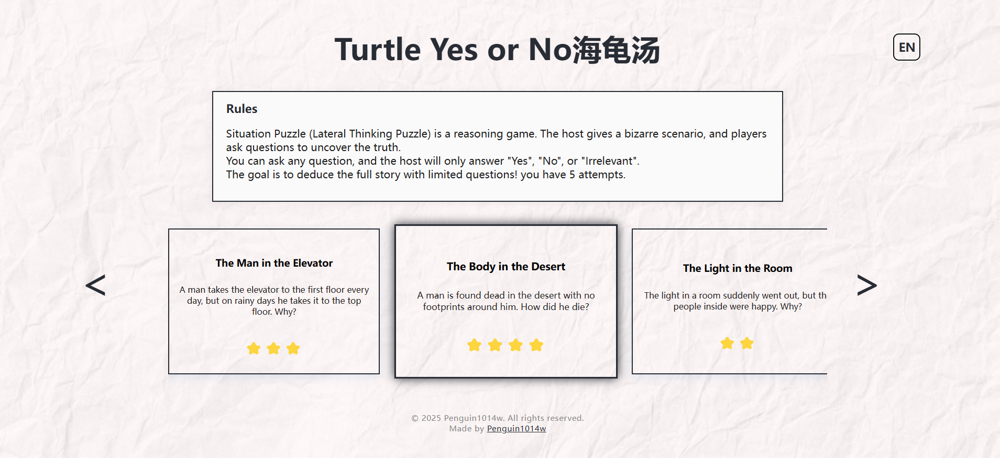
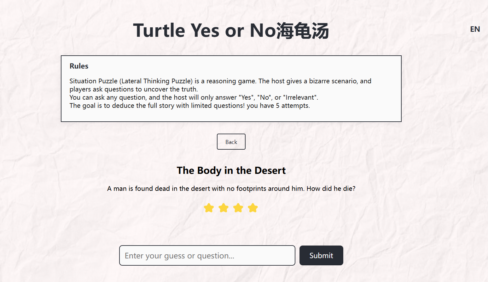

# SituationPuzzle海龟汤

A situation puzzle (lateral thinking puzzle) game built with Go and React, integrated with DEEPSEEK for answer validation.

## Live Demo

👉 [Visit the Website](https://situationpuzzle.pages.dev/)

## Sample Screenshots

- Chinese Home Page
  
  

- English Home Page
  
  

- Game Play Interface
  
  

## Features

- Multiple preset situation puzzles
- Users can select a puzzle and make guesses
- Uses ChatGPT API for answer validation
- 5 attempts per puzzle
- Clean and beautiful user interface

## Tech Stack

- Backend: Go
- Frontend: React
- API: OpenAI ChatGPT (via DEEPSEEK)

## Installation & Run

### Backend

1. Enter the backend directory:
```bash
cd backend
```

2. Set environment variable:
```bash
export OPENAI_API_KEY=your_openai_api_key
```

3. Run the backend server:
```bash
go run main.go chatgpt.go
```

### Frontend

1. Enter the frontend directory:
```bash
cd frontend
```

2. Install dependencies:
```bash
npm install
```

3. Start the development server:
```bash
npm start
```

## Usage

1. Select a puzzle on the home page
2. Enter your guess or question
3. The system will use DeepSeek to validate your answer
4. You have 5 attempts per puzzle
5. After solving or using all attempts, you can return to select another puzzle

## Notes

- Make sure to set the correct OpenAI API key
- Backend server runs on port 8080 by default
- Frontend development server runs on port 3000 by default 
